# Serve Static Content Using Amazon S3 and CloudFront

## Create an Amazon S3 Bucket
### Steps
- Navigate to **S3** section using search bar.

    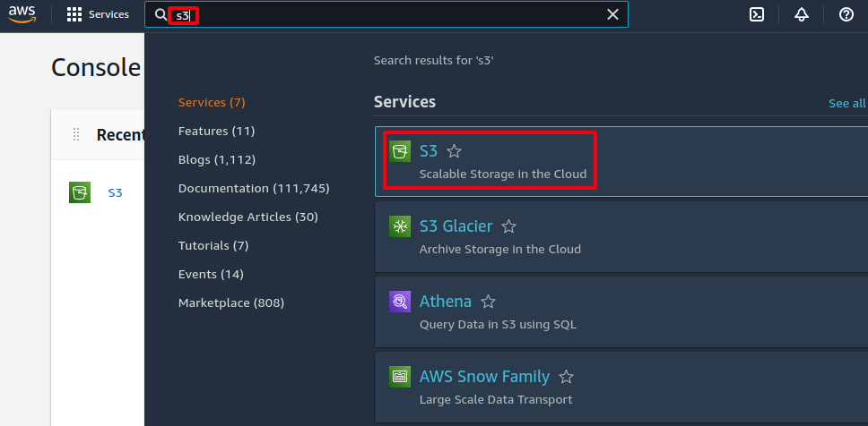

- Click on **Create bucket**. This bucket is used for storing your static content.

    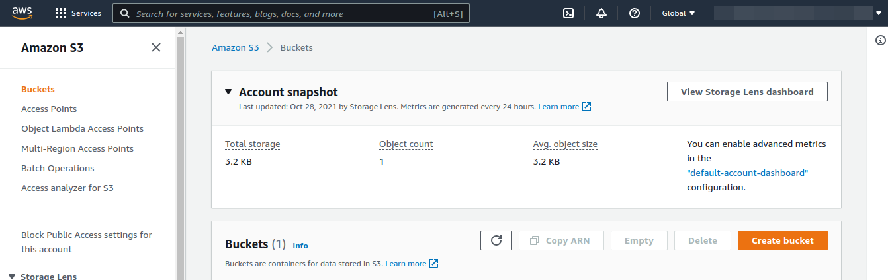

- Provide **Bucket  name** and **AWS region**. Rest of the options can go with defaults or change per your requirement and click on **create bucket**, located at bottom of the page.

    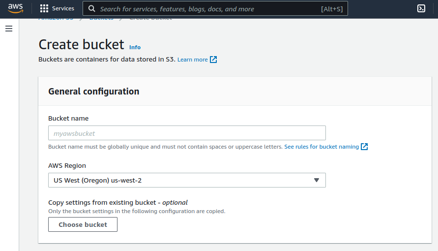

## Upload Files to an S3 Bucket
### Steps
- Navigate to **S3** section using search bar.

    

- Locate your **S3** bucket created for uploading static content and click on its name to open the bucket.
- Locate and use **upload** option to upload your static content to **S3** bucket. in **Files and folders** section, leverage provided options to add your static content files to the **S3** bucket. If adding files are done, click on **Upload** button, located at bottom of the page to upload the files.

    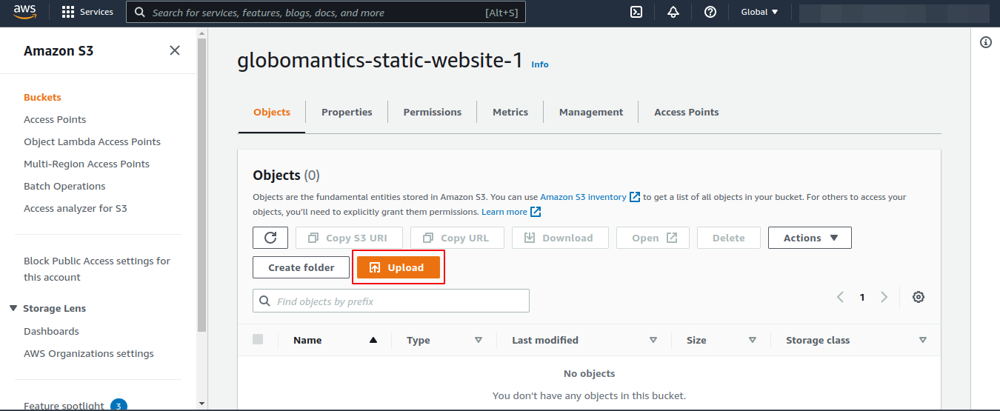

## Configure an S3 Bucket's Permissions
### Steps
-  Navigate to **S3** section using search bar.

    

- Locate your **S3** bucket created for uploading static content and click on its name to open the bucket.

- Navigate to **Permissions** tab.

    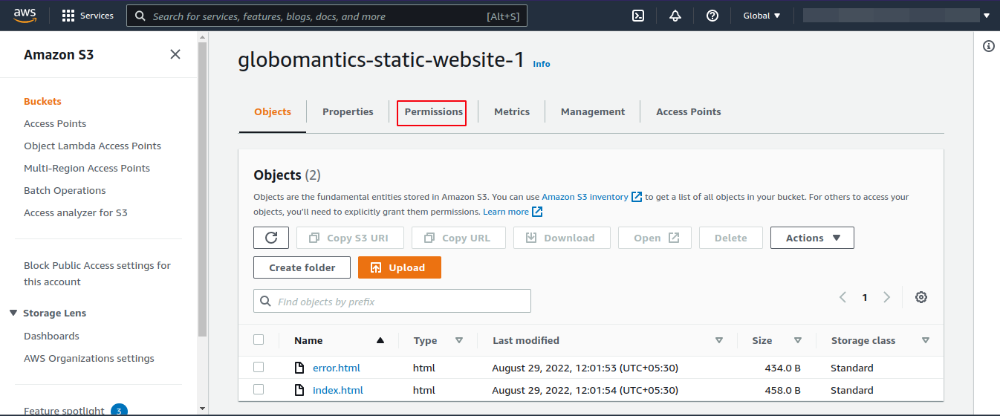

- By default, Public access is **blocked**. So, now we need to change the bucket settings to unblock public access. Click **Edit** under **Block public access (bucket settings)**. Uncheck **Block all public access** check box and click on **Save changes**. Type `confirm` to apply the change.

    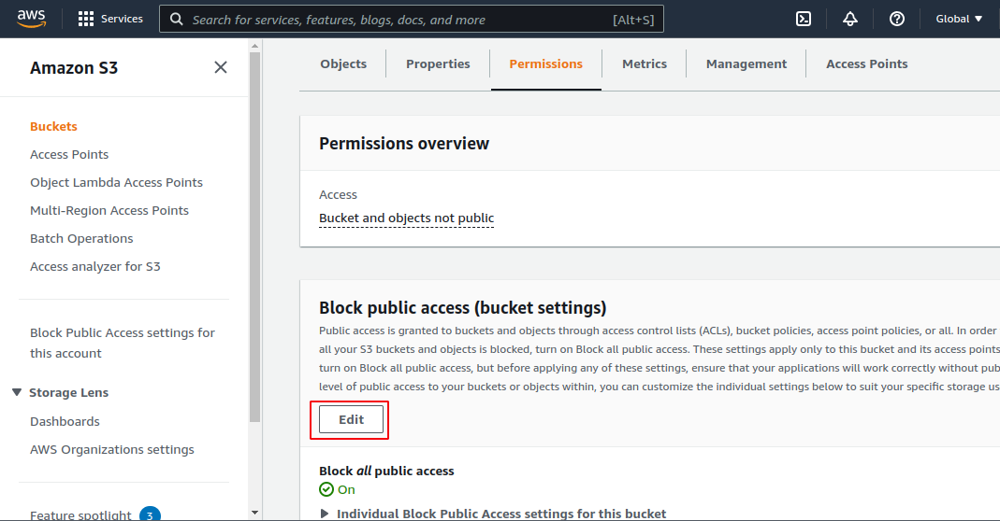

    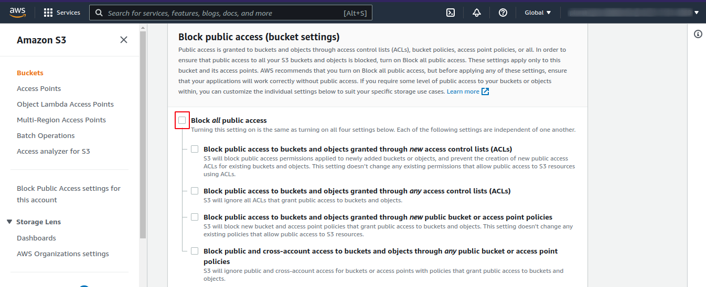

- Now, you will land on the **Permissions** tab, scroll down and find **Bucket Policy**. Click on **Edit** to define a policy.

    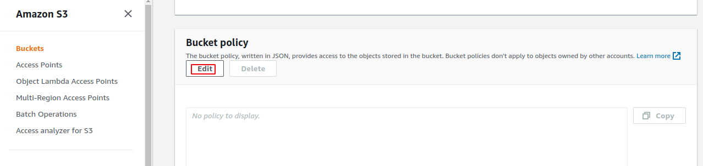

- For generating policy use [AWS Policy Generator](https://awspolicygen.s3.amazonaws.com/policygen.html) tool.
    1. In **Select Policy Type**, choose **S3 Bucket Policy**
    2. In  **Add Statement(s)** section
        - **Effect** - Allow
        - **Principal** - *
        - **Actions**, click on dropdown, find and select `GetObject`.
        - **Amazon Resource Name (ARN)** - Type your Bucket ARN.

            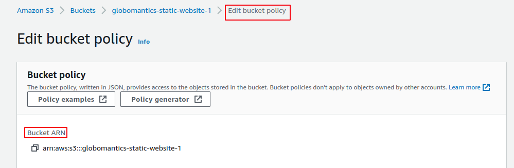

        - Click on **Add Statement** button.

    3. In **Generate Policy** section, click on **Generate Policy** button to generate bucket policy.

- Copy and paste the generated policy in **Policy** text area and click on **Save changes**.

- **Note**: After copying in **Resource** key append `/*` to its value.
    - e.g.:`"Resource": "arn:aws:s3:::globomantics-static-website-1/*"`

    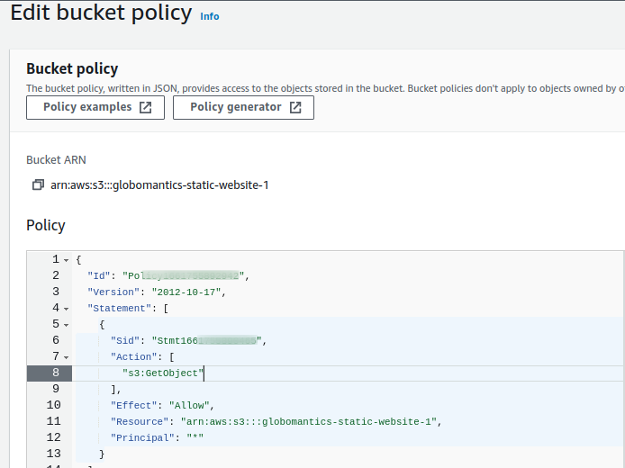

## Enable Static Website Hosting
### Steps
-  Navigate to **S3** section using search bar.

    

- Locate your **S3** bucket created for uploading static content and click on its name to open the bucket.

- Navigate to **Properties** tab.
    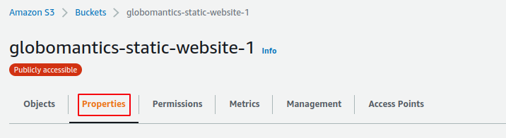

- Scroll and find **Static website hosting** section. Click on **Edit**.

    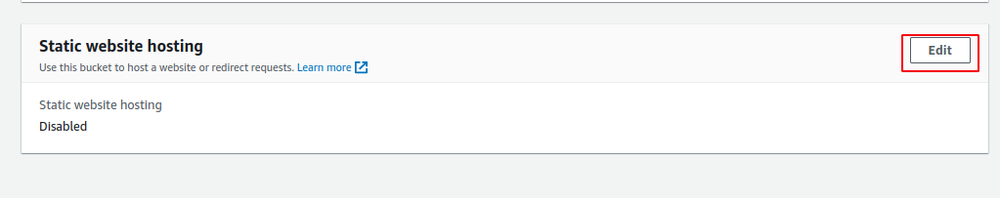

- In **Static website hosting**, select **Enable**. **Hosting type** is **Host a static website**. In **Index document** specify the homepage of your website. In **Error document** specify the error page and it is *optional*. Click on **Save changes**.

    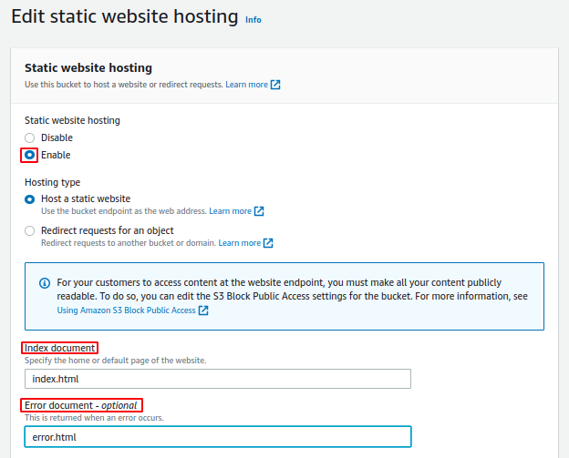

## Create a CloudFront Distribution
### Steps
-  Navigate to **CloudFront** section using search bar.

    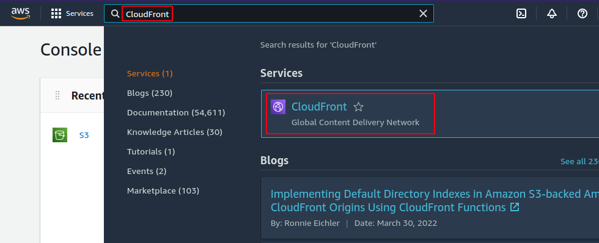

- Click on **Create a CloudFront distribution**.

    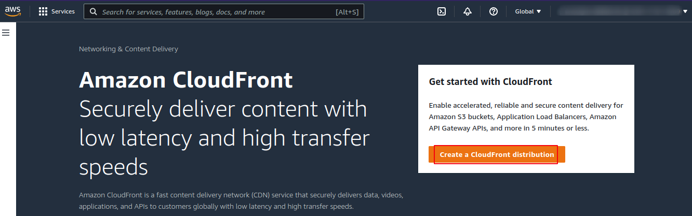

- Under **Origin** section, in **Origin domain**, type or choose your static content **S3** bucket name.

- Under **Settings** section, in **Default root object** type the homepage page of your website
    - e.g. **index.html**

- Rest of the configuration can go with defaults or change per your requirement.

- Finally click on **Create distribution**.

- You will be re-directed to your distribution page. In **General** section under **Details** pane, **Last modified** status should changed be a timeframe instead of **deploying**, you can refresh page to view it. 

- Then, to access or view or test the page copy **Distribution domain name** in **Details** pane and paste in a tab to view the site.

**Viola, reached end of the guide for Serve Static Content Using Amazon S3 and CloudFront is completed.**

**Happy Learning :)**
